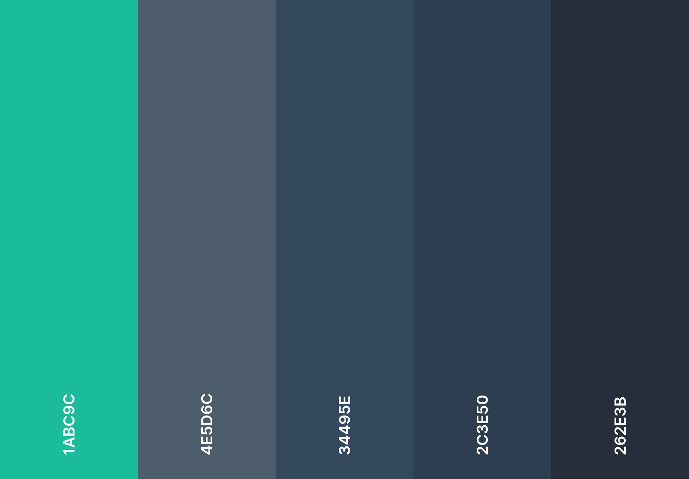

# 🌟 **Descripción del Proyecto** 🌟

## 🎨 **Códigos de Colores**

- `--primary-color: #262e3b;`  /* Color base */
- `--secondary-color: #2c3e50;`  /* Gris oscuro */
- `--highlight-color: #4e5d6c;`  /* Azul oscuro */
- `--accent-color: #34495e;`  /* Gris azulado */
- `--neon-color: #1abc9c;`  /* Un color neón suave (para detalles) */

 <!-- Añadir imagen de la paleta de colores -->
- - -
## ✒️ **Tipografías**

1. **Source Code Pro** 
2. **Quicksand**
- - -

## 🖼️ **Logo**

El logo personal está disponible en una versión:
- ⚫ **Negro**

- - -

## 📚 **Librerías Empleadas**

- **Librerías usadas**:
  - jQuery
  - Bootstrap Icons
  - Animate.css

- - -

## 🌐 **Enlaces Web**

- **Iberdrola**: [Enlace a la página web](https://ismavargass.github.io/Iberdrola/)
- **Astralis**: [Astralis](https://github.com/IsmaVargass/Astralis-Game)
- **BookTrack**: [Enlace al repositorio](https://github.com/Proyecto-BookTrack/Proyecto-BookTrack)
- **Redes Sociales**:
  - [Instagram](https://instagram.com/ismavargass)
  - [GitHub](https://github.com/IsmaVargass) 
  - [LinkedIn](https://www.linkedin.com/in/ismael-vargas-duque/) 
- - -

## 🛠️ **Problemas Encontrados Durante el Desarrollo**

1. **Fade-up en JS**: Tuve que implementar el efecto de fade-up en JavaScript, ya que no es soportado de forma consistente por algunos navegadores usando solo CSS. 🔧

2. **Proyectos**: La parte de los proyectos me llevó más tiempo del que inicialmente había previsto debido a ajustes y mejoras constantes. ⏳

3. **Cambio de Idea Inicial**: Comencé con una idea para el proyecto que no me convenció y tuve que desarrollarla desde cero de una manera completamente diferente. 💡🔄
